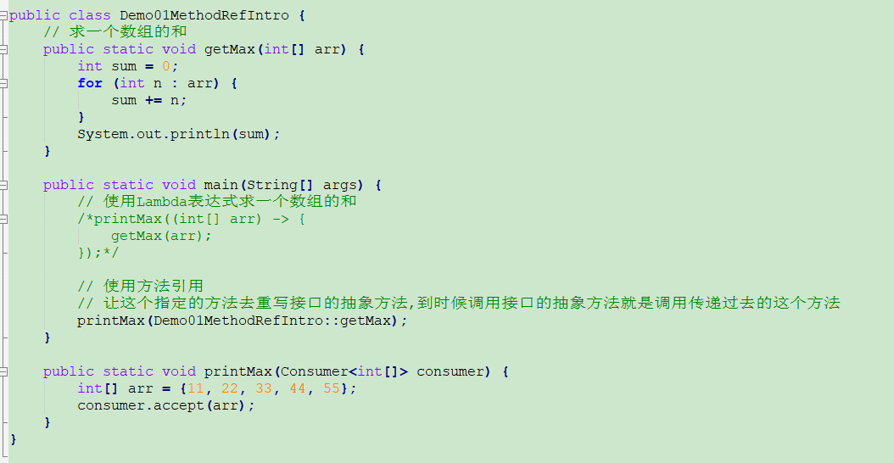
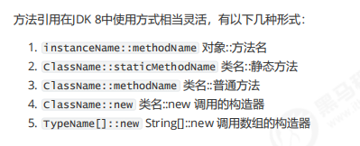
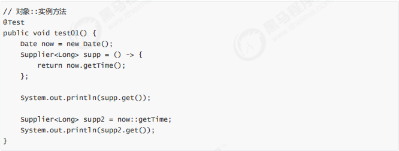
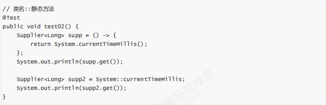
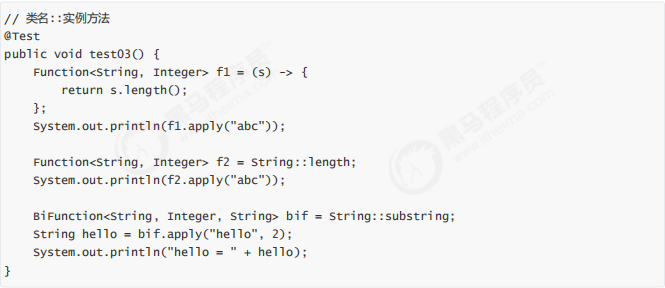
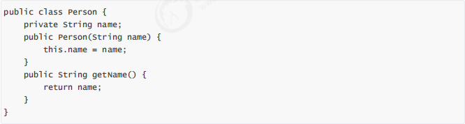
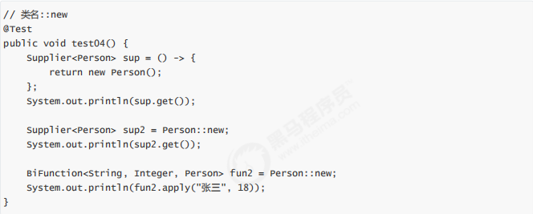
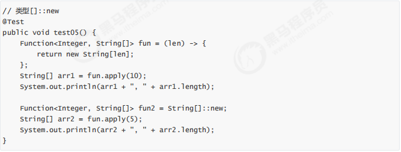

## Lambda表达式

定义：一个**匿名函数**，可以理解为一段可以传递的代码。对接口中抽象方法的重写

### 普通匿名函数

```java
public static void main(String[] args) {
	System.out.println("普通匿名函数");
}
```


### Lambda表达式格式

```java
(参数列表) -> {
    ...
    方法体
    ...
    System.out.println("Lanbda匿名函数");
}
(1) ()：表示参数列表
(2) {}：方法体
(3) ->：没有实际含义 起到连接的作用
```

*：可以使用Lambda表达式代替匿名内部类，但是**不是**所有的匿名内部类都能使用Lambda表达式


### Lambda实现原理

​	普通匿名内部类编译后会形成带有 "$" f符号的特殊 .class 文件

​	Lambda在程序运行的时候形成一个类

​		(1) 在类中新增一个方法，这个方法的方法体就是Lambda表达式的代码

​		(2) 还会形成一个匿名内部类，实现接口，重写抽象方法

​		(3) 在接口的重写方法中调用新生成的方法


### Lambda省略模式

​		(1) 小括号内参数的类型可以省略 

​		(2) 如果小括号内有且仅有一个参数，则小括号可以省略

​		(3) 如果大括号内有且仅有一个语句，可以 ***同时***省略大括号、return关键字及语句分号

```java
(int a) -> {
	return new Person();
}
//省略后
a -> new Person()
```


### Lambda的前提条件

​	(1) 方法的参数或局部变量类型必须为接口才能使用Lambda

​	(2) 接口中有且只有一个抽象方法（函数式接口）

**：java 8 新增判断是不是函数式接口的注解  @FunctionInterface*  


### Lambda和匿名内部类的对比

​	(1) 所需类型不一样

​		匿名内部类需要的类型可以是类、抽象类、接口

​		Lambda表达式需要的类型必须是接口

​	(2) 抽象方法的数量不一样

​		匿名内部类所需的接口中抽象法数量随意

​		Lambda表达式所需的接口自能有一个抽象方法

​	(3) 实现原理不同

​		匿名内部类是在编译后形成 .class 文件

​		Lambda表达式是在程序运行的时候动态生成 .class文件

​	当接口中只有一个抽象方法时推荐使用Lambda表达式，其他情况还是使用匿名内部类

​	

## JDK 8 接口新增的两个方法

​	JDK 8 对接口的增强，接口可以有默认方法和静态方法

​	场景1：一个接口新增方法，则实现了这个接口的每一个类都需要重新这个新增的方法

​	JDK 8 新增了接口的默认方法：接口中的默认方法实现类不必重写，可以直接使用，实现类也可根据需要重写，方便接口的扩展


### 接口默认方法的定义格式

```java
interface 接口名 {
	修饰符 default 返回值类型 方法名 () {
		...
		//代码块
		...
	}
}
```


### 接口默认方法的使用

​	(1) 实现类可以直接使用接口默认方法

​	(2) 实现类可以重写接口默认方法

 

### 接口静态方法的定义格式

```java
interface 接口名 {
	修饰符 static 返回值类型 方法名 () {
		...
         //代码块
         ...
	}
}
```

​	

### 接口静态方法的使用

​	使用接口名.静态方法();


### 接口默认方法和静态方法的区别

​	(1) 默认方法通过实例调用，静态方法通过接口直接调用

​	(2) 默认方法可以被继承，实现类可以直接使用接口默认方法，也可以重写默认方法

​	(3) 静态方法不能被继承，实现类不能重写静态方法，只能使用接口名调用

*：接口中的方法需要被实现类继承或重写，使用默认方法，如果接口中的方法不需要被继承就是用静态方法


### 常用内置函数式接口

#### 	内置函数式接口的由来

​		Lambda表达式的前提是函数式接口。Lambda表达式使用时不关心接口名，抽象方法名，只关心抽象方法的参数列表和返回值类型。

#### 	常用函数式接口

​		(1) Supplier	--供给型接口

```java
@FunctionalInterface
public interface Supplier<T> {
    
    T get();
    
}
```

​		(2) Consumer	--消费型接口

```java
@FunctionalInterface
public interface Consumer<T> {
    
    void accept(T t);
 
    default Consumer<T> andThen(Consumer<? super T> after) {
        Objects.requireNonNull(after);
        return (T t) -> { accept(t); after.accept(t); };
    }
}
```

​		(3) Function	

```java
@FunctionalInterface
public interface Function<T, R> {

    R apply(T t);
 
    default <V> Function<V, R> compose(Function<? super V, ? extends T> before) {
        Objects.requireNonNull(before);
        return (V v) -> apply(before.apply(v));
    }
 
    default <V> Function<T, V> andThen(Function<? super R, ? extends V> after) {
        Objects.requireNonNull(after);
        return (T t) -> after.apply(apply(t));
    }
 
    static <T> Function<T, T> identity() {
        return t -> t;
    }
}
```

​		(4) Predicate	--判断型接口

```java
@FunctionalInterface
public interface Predicate<T> {
 
    boolean test(T t);

    //且
    default Predicate<T> and(Predicate<? super T> other) {
        Objects.requireNonNull(other);
        return (t) -> test(t) && other.test(t);
    }
 
    //取反
    default Predicate<T> negate() {
        return (t) -> !test(t);
    }
 
    //或
    default Predicate<T> or(Predicate<? super T> other) {
        Objects.requireNonNull(other);
        return (t) -> test(t) || other.test(t);
    }
 
    //比较
    static <T> Predicate<T> isEqual(Object targetRef) {
        return (null == targetRef)
                ? Objects::isNull
                : object -> targetRef.equals(object);
    }
}
```


### 方法引用

#### 	Lambda表达式的冗余场景



#### 	方法用于格式

​		符号表示：**::**

​		符号说明：双冒号为方法引用运算符，而他所在的表达式被称为**方法引用**

​		应用场景：如果Lambda表达式所要实现的方案，已经有其他方法存在相同的方案，那么则可以使用方法引用

#### 	常见方法引用方式

​											

#### 	对象名::引用成员方法

#### 								

###### 		注意事项：

​		(1) 被引用的方法，参数要和接口中抽象方法的参数一样

​		(2) 当接口抽象方法有返回时，被引用的方法也必须有返回值

#### 	类名::引用静态方法

#### 								

#### 	类名::引用实例方法

#### 								

#### 	类名::new引用构造器

#### 								

#### 								

#### 	类名::new 引用数组构造器

​						

​	*：方法引用是对Lambda表达式符合特定情况下的一种缩写，它使得Lambda表达式更加精简，也可以理解成Lambda表达式的缩写形式，不过要注意方法引用只能"引用"已经存在的方法


