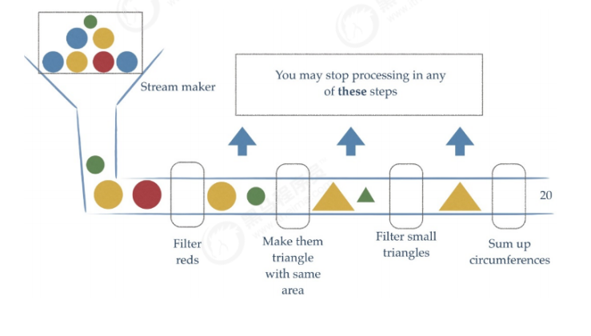
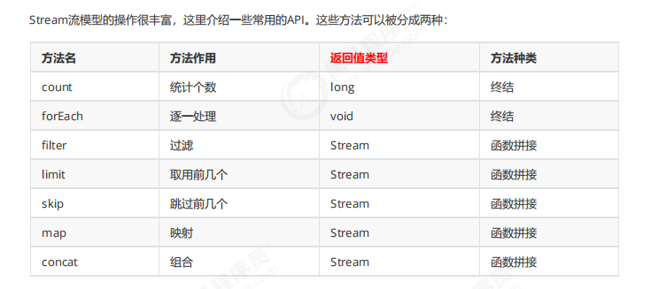
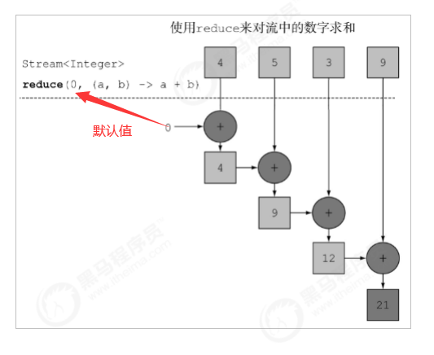
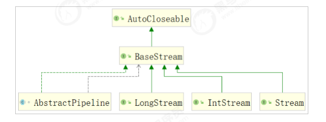
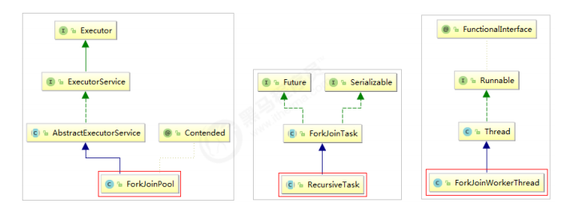
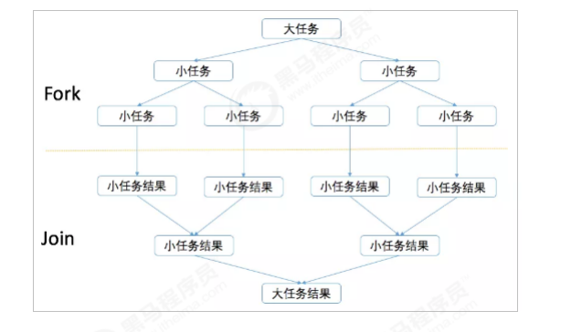
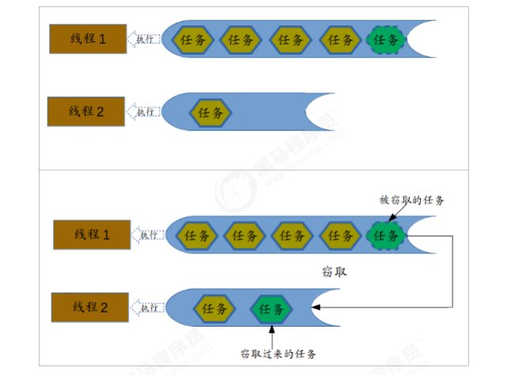
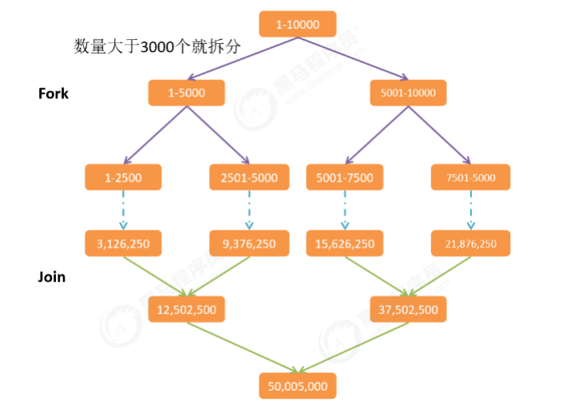

# 集合之Stream流式操作

## 	集合处理数据的弊端

​		每一个需求都要循环，还需要定义一个新的集合来装数据，如果希望再次遍历，只能再使用另一个循环从头开始


## 	Stream流式思想概述

​		`*`：Stream流和IO流没有任何关系

​		Stream流式思想类似于工厂车间的"生成流水线"，不是一种数据结构，不保存数据，只是对数据进行加工处理。Stream流可以看作是流水线上的一个工序。多个工序使原材料加工成商品。

​		

Stream API能让我们快速完成许多复杂的操作，如筛选、切片、映射、查找、去重、统计、匹配和归约


## 	获取Stream流的两种方法

​		方法一：所有的Collection集合都可以通过Stream默认方法获取流

​			Collection接口中有一个默认的方法Stream用来获取流

```java
    default Stream<E> stream() {
        return StreamSupport.stream(spliterator(), false);
    }
	
	//调用方法
	List<String> list = new ArrayList<>();
	Stream<String> stream = list.stream();

	Set set = new HashSet();
	Stream stream = set.stream();

	//Map接口不是Collection的子接口，获取对应的流需要key、value或entry等情况
	Map map = new HashMap();
	Stream stream = map.keySet().stream();
	Stream stream = map.values().stream();
	Stream stream = map.entrySet().stream();
```

​		方法二：Stream接口的静态方法of可以获取数据对应的流

​			数组对象不可能添加默认方法，所以Stream接口提供了静态方法of

```java
    Stream<String> stream  = Stream.of("12","32","55","24","42");

    String []arr = {"12","32","55","24","42"};
    Stream<String> stream = Stream.of(arr);

    Integer []arr2 = {32,12,52,22};
    Stream<Integer> stream = Stream.of(arr2);
	
	//基本数据类型的数组不行--把整个数组看成一个元素进行操作，而不是操作数组中的数据
    int []a = {32,12,23,51};
    Stream<int[]> stream = Stream.of(a);
```


## 	Stream常用方法



​		**终结方法：**返回值不再是Stream类型的方法，不再支持链式调用

​		**非终结方法：**返回值类型任然是Stream，支持链式调用


## 	Stream注意事项*

​		(1) Stream只能操作一次

​		(2) Stream方法返回的是新的流

​		(3) Stream不调用终结方法，中间的操作不会执行


## Stream流常用方法

### 	forEach方法

```java
// 循环
void forEach(Consumer<? super T> action);
```

### 	count方法 

```java
// 求个数
long count();
```

### 	filter方法

```java
// 过滤
Stream<T> filter(Predicate<? super T> predicate);
```

### 	limit方法

```java
// 取 maxSize 个元素
Stream<T> limit(long maxSize);
```

### 	skip方法

```java
//跳过 n 个元素
Stream<T> skip(long n);
```

### 	map方法

```java
// 把一种类型的流映射成另一种类型的流
<R> Stream<R> map(Function<? super T, ? extends R> mapper);
```

### 	sorted方法

```java
// 根据元素的自然顺序排序
Stream<T> sorted();
```

### 	distinct方法

```java
// 去重  *：若为简单数据类型 int string 可以直接去重，若为对象，需重写对象hashCode和equals来去重
Stream<T> distinct();
```

### 	match系列方法

```java
// 是否全都满足
boolean anyMatch(Predicate<? super T> predicate);
// 是否任意有一个满足
boolean allMatch(Predicate<? super T> predicate);
// 是否全都不满足
boolean noneMatch(Predicate<? super T> predicate);
```

### 	find系列方法

```java
// 返回 Optional 表示可能找到可能找不到
// 返回第一个元素
Optional<T> findFirst();
// 返回所有的元素
Optional<T> findAny();
```

### 	min方法和max方法

```java
// 获取最大值
Optional<T> max(Comparator<? super T> comparator);
// 获取最小值
Optional<T> min(Comparator<? super T> comparator);
```

### 	reduce方法

```java
// 将集合中的数据归纳得到一个数据 identity--默认值 accumulator--对数据处理的方式
T reduce(T identity, BinaryOperator<T> accumulator);
```

##### 																				

### 	mapToInt方法

```java
// 将Stream<Integer>中的Integer转换成int类型 mapToLong mapToDouble同理
// IntStream和Stream都继承BaseStream，区别在于IntStream操作int基本类型，节省内存，减少自动装箱和拆箱
IntStream mapToInt(ToIntFunction<? super T> mapper);
```

##### 													

### 	concat方法

```java
// 将两个流合并成一个流--concat是Stream的静态方法
// 这是一个静态方法，不同于java.long.String当中的concat方法，只能接受两个参数
// 两个流合并后不能操作之前的流
static <T> Stream<T> concat(Stream<? extends T> a, Stream<? extends T> b)
```


## 收集Stream流中的结果

​	Stream流提供collect方法，其参数需要一个java.util.stream.Collector<T,A, R> 接口对象来指定收集到哪种集合中。java.util.stream.Collectors 类提供一些方法，可以作为 Collector 接口的实例：

```java
public static <T> Collector<T, ?, List<T>> toList(); // 转换为 List 集合。

public static <T> Collector<T, ?, Set<T>> toSet(); // 转换为 Set 集合。
```

### 		Stream流中的结果到集合中

```java
Stream<String> stream = Stream.of("aa", "bb", "cc");
List<String> list = stream.collect(Collectors.toList());
Set<String> set = stream.collect(Collectors.toSet()); 
ArrayList<String> arrayList = stream.collect(Collectors.toCollection(ArrayList::new)); 
HashSet<String> hashSet = stream.collect(Collectors.toCollection(HashSet::new)); }
```

### 	Stream流中的结果到数组中

​		Stream提供 toArray 方法来将结果放到一个数组中，返回值类型是Object[]的：

```java
Stream<String> stream = Stream.of("aa", "bb", "cc");
// 无参 返回 Object[]
Object[] objects = stream.toArray();
// 有参 返回 参数类型
String[] strings = stream.toArray(String[]::new); 

```

### 	对流中的数据进行聚合计算

```java
Stream<Student> studentStream = Stream.of(new Student("赵丽颖", 58, 95), 
                                          new Student("杨颖", 56, 88), 
                                          new Student("迪丽热巴", 56, 99), 
                                          new Student("柳岩", 52, 77)); 
// 获取最大值 
Optional<Student> collect = studentStream.collect(Collectors.maxBy((o1, o2) -> o1.getSocre() - o2.getSocre())); 
// 获取最小值 
Optional<Student> collect = studentStream.collect(Collectors.minBy((o1, o2) -> o1.getSocre() - o2.getSocre())); 
// 求总和 
int sumAge = studentStream.collect(Collectors.summingInt(s -> s.getAge()));
// 平均值 
double avgScore = studentStream.collect(Collectors.averagingInt(s -> s.getSocre()));
// 统计数量 
Long count = studentStream.collect(Collectors.counting()); 
```

### 	对流中数据进行分组

```java
Stream<Student> studentStream = Stream.of(new Student("赵丽颖", 52, 95), 
                                          new Student("杨颖", 56, 88), 
                                          new Student("迪丽热巴", 56, 55), 
                                          new Student("柳岩", 52, 33)); 
Map<Integer, List<Student>> map = studentStream.collect(Collectors.groupingBy(Student::getAge)); 
// 将分数大于60的分为一组,小于60分成另一组 
Map<String, List<Student>> map = studentStream.collect(
    Collectors.groupingBy((s) ->{ 
        if (s.getSocre() > 60) { 
            return "及格"; 
        } else { 
            return "不及格"; 
        } 
    })); 
map.forEach((k, v) -> { System.out.println(k + "::" + v); }); 

结果：
不及格::[Student{name='迪丽热巴', age=56, socre=55}, Student{name='柳岩', age=52, socre=33}] 
及格::[Student{name='赵丽颖', age=52, socre=95}, Student{name='杨颖', age=56, socre=88}]
```

### 	对流中数据进行多级分组

```java
Stream<Student> studentStream = Stream.of(new Student("赵丽颖", 52, 95), 
                                          new Student("杨颖", 56, 88), 
                                          new Student("迪丽热巴", 56, 99),
                                          new Student("柳岩", 52, 77)); 
Map<Integer, Map<String, List<Student>>> map = studentStream.collect(
    Collectors.groupingBy(s -> s.getAge(), Collectors.groupingBy(s -> { 
        if (s.getSocre() >= 90) { 
            return "优秀"; 
        } else if (s.getSocre() >= 80 && s.getSocre() < 90) { 
            return "良好"; 
        } else if (s.getSocre() >= 80 && s.getSocre() < 80) { 
            return "及格"; 
        } else { 
            return "不及格"; 
        } 
    }))); 
map.forEach((k, v) -> { System.out.println(k + " == " + v); });

// 结果
52 == {
    不及格=[Student{name='柳岩', age=52, socre=77}], 优秀=[Student{name='赵丽颖', age=52, socre=95}]
} 
56 == {
    优秀=[Student{name='迪丽热巴', age=56, socre=99}], 良好=[Student{name='杨颖', age=56, socre=88}]
}
```

### 对流中数据进行分区

```java
Stream<Student> studentStream = Stream.of(new Student("赵丽颖", 52, 95),
                                          new Student("杨颖", 56, 88), 
                                          new Student("迪丽热巴", 56, 99), 
                                          new Student("柳岩", 52, 77)); 
// partitioningBy会根据值是否为true，把集合分割为两个列表，一个true列表，一个false列表。 
Map<Boolean, List<Student>> map = studentStream.collect(
    Collectors.partitioningBy(s -> s.getSocre() > 90));
map.forEach((k, v) -> { System.out.println(k + " == " + v); });

// 结果
false == [Student{name='杨颖', age=56, socre=88}, Student{name='柳岩', age=52, socre=77}]
true == [Student{name='赵丽颖', age=52, socre=95}, Student{name='迪丽热巴', age=56, socre=99}]
```

​	*：不同于 groupingBy。groupingBy 可以分成多个组，partitioningBy 只能分为两个组

### 	对流中数据进行拼接

```java
Stream<Student> studentStream = Stream.of(new Student("赵丽颖", 52, 95), 
                                          new Student("杨颖", 56, 88), 
                                          new Student("迪丽热巴", 56, 99), 
                                          new Student("柳岩", 52, 77)); 
String collect = studentStream.map(Student::getName).collect(Collectors.joining(">_<","^_^","^v^")); 
System.out.println(collect);

// 结果
^_^赵丽颖>_<杨颖>_<迪丽热巴>_<柳岩^v^
```


## 并行的Stream流

​	前面的Stream流是串行流，就是在一个线程上执行

​	parallelStream其实就是一个并行执行的流。它通过默认的ForkJoinPool，可能提高多线程任务的速度。

### 	获取并行Stream流的两种方式

​		1、直接获取并行的流

​		2、将串行流转成并行流

```java
ArrayList<Integer> list = new ArrayList<>(); 
// 方法一：直接获取并行的流 
Stream<Integer> stream = list.parallelStream(); 
// 方法二：将串行流转成并行流 
Stream<Integer> stream = list.stream().parallel();
```

​		并行流展示：

```java
long count = Stream.of(4, 5, 3, 9, 1, 2, 6) .parallel() // 将流转成并发流,Stream处理的时候将才去 
    .filter(s -> { 
        // Thread.currentThread() 表示 当前的线程
        System.out.println(Thread.currentThread() + ", s = " + s); 
        return true; 
    }).count(); 
System.out.println("count = " + count);

// 结果
Thread[ForkJoinPool.commonPool-worker-13,5,main], s = 3 
Thread[ForkJoinPool.commonPool-worker-19,5,main], s = 6 
Thread[main,5,main], s = 1 
Thread[ForkJoinPool.commonPool-worker-5,5,main], s = 5 
Thread[ForkJoinPool.commonPool-worker-23,5,main], s = 4 
Thread[ForkJoinPool.commonPool-worker-27,5,main], s = 2 
Thread[ForkJoinPool.commonPool-worker-9,5,main], s = 9 
count = 7
```


### 	并行和串行Stream流的效率对比

```java
// 使用for循环，串行Stream流，并行Stream流来对5亿个数字求和。看消耗的时间。
private static long times = 50000000000L; 
private long start; 
@Before 
public void init() { 
    start = System.currentTimeMillis(); 
}

@After 
public void destory() { 
    long end = System.currentTimeMillis(); 
    System.out.println("消耗时间: " + (end - start));
}

// 测试效率,parallelStream 120 
@Test 
public void parallelStream() { 
    System.out.println("serialStream"); 
    LongStream.rangeClosed(0, times).parallel().reduce(0, Long::sum); 
}

// 测试效率,普通Stream 342
@Test 
public void serialStream() { 
    System.out.println("serialStream"); 
    LongStream.rangeClosed(0, times).reduce(0, Long::sum); 
}

// 测试效率,正常for循环 421 
@Test 
public void forAdd() { 
    System.out.println("forAdd"); 
    long result = 0L; 
    for (long i = 1L; i < times; i++) { 
        result += i; 
    } 
}

// 结论：parallelStream的效率是最高的。
```

​		*：Stream并行处理的过程会分而治之，也就是将一个大任务切分成多个小任务，这表示每个任务都是一个操作。

### 	

### 	parallelStream线程安全问题

```java
// 解决parallelStream线程安全问题
// 并行流注意事项 
@Test 
public void parallelStreamNotice() { 
    ArrayList<Integer> list = new ArrayList<Integer>(); 
    for (int i = 0; i < 1000; i++) { 
        list.add(i); 
    }
    List<Integer> newList = new ArrayList<>(); 
    // 使用并行的流往集合中添加数据
    list.parallelStream().forEach(s -> { 
        newList.add(s); 
    }); 
    System.out.println("newList = " + newList.size()); 
}

// 运行效果：
newList = 903
```

​		*：我们明明是往集合中添加1000个元素，而实际上只有903个元素。

​		解决方法： 加锁、使用线程安全的集合或者调用Stream的 toArray() / collect() 操作就是满足线程安全的了。

```java
// 解决parallelStream线程安全问题方案一: 使用同步代码块
Object obj = new Object();
IntStream.rangeClosed(1, 1000)
    .parallel()
    .forEach(i -> {
        synchronized (obj) {
            list.add(i);
        }
    });
System.out.println("list.size = " + collect.size());

// 解决parallelStream线程安全问题方案二: 使用线程安全的集合
Vector<Integer> v = new Vector();
List<Integer> synchronizedList = Collections.synchronizedList(list);
IntStream.rangeClosed(1, 1000)
    .parallel()
    .forEach(i -> {
        synchronizedList.add(i);
    });
System.out.println("list.size = " + synchronizedList.size());

// 解决parallelStream线程安全问题方案三: 调用Stream流的collect/toArray
List<Integer> list = IntStream.rangeClosed(1, 1000)
    .parallel()
    .boxed()
    .collect(Collectors.toList());
System.out.println("list.size = " + collect.size());

// 以上三种方法结果
list.size = 1000
```


### 	parallelStream背后的技术

#### 			Fork/Join框架介绍

​			parallelStream使用的是Fork/Join框架。

​			Fork/Join框架自JDK 7引入。Fork/Join框架可以将一个大任务拆分为很多小任务来异步执行。

#### 			Fork/Join框架主要包含三个模块：

​			1、程池：ForkJoinPool

​			2、任务对象：ForkJoinTask

​			3、执行任务的线程：ForkJoinWorkerThread

​			


#### 	Fork/Join原理

##### 		分治法

​		ForkJoinPool主要用来使用分治法(Divide-and-Conquer Algorithm)来解决问题。典型的应用比如快速排序算法，ForkJoinPool需要使用相对少的线程来处理大量的任务。比如要对1000万个数据进行排序，那么会将这个任务分割成两个500万的排序任务和一个针对这两组500万数据的合并任务。以此类推，对于500万的数据也会做出同样的分割处理，到最后会设置一个阈值来规定当数据规模到多少时，停止这样的分割处理。比如，当元素的数量小于10时，会停止分割，转而使用插入排序对它们进行排序。那么到最后，所有的任务加起来会有大概2000000+个。问题的关键在于，对于一个任务而言，只有当它所有的子任务完成之后，它才能够被执行。



##### 	工作窃取算法

​		Fork/Join最核心的地方就是利用了现代硬件设备多核，在一个操作时候会有空闲的cpu，那么如何利用好这个空闲的cpu就成了提高性能的关键，而这里我们要提到的工作窃取（work-stealing）算法就是整个Fork/Join框架的核心理念Fork/Join工作窃取（work-stealing）算法是指某个线程从其他队列里窃取任务来执行。

​						

​			工作窃取算法的优点是充分利用线程进行并行计算，并减少了线程间的竞争，其缺点是在某些情况下还是存在竞争，比如双端队列里只有一个任务时。并且消耗了更多的系统资源，比如创建多个线程和多个双端队列


​			对于ForkJoinPool通用线程池的线程数量，通常使用默认值就可以了，即运行时计算机的处理器数量。可以通过设置系统属性：java.util.concurrent.ForkJoinPool.common.parallelism=N （N为线程数量），来调整ForkJoinPool的线程数量，可以尝试调整成不同的参数来观察每次的输出结果。


### 	Fork/Join案例

​		1、使用Fork/Join计算1-10000的和，当一个任务的计算数量大于3000时拆分任务，数量小于3000时计算。



```java
public class Demo07ForkJoin { 
    public static void main(String[] args) { 
        long start = System.currentTimeMillis(); 
        ForkJoinPool pool = new ForkJoinPool(); 
        SumRecursiveTask task = new SumRecursiveTask(1, 10000L); 
        Long result = pool.invoke(task); 
        System.out.println("result = " + result); 
        long end = System.currentTimeMillis(); 
        System.out.println("消耗的时间为: " + (end - start)); 
    }

}

// RecursiveTask：一个任务
class SumRecursiveTask extends RecursiveTask<Long> { 
    // 是否拆分的临界值
    private static final long THRESHOLD = 3000L; 
    // 起始值
    private final long start; 
    // 结束值
    private final long end; 
    
    public SumRecursiveTask(long start, long end) { 
        this.start = start; 
        this.end = end; 
    }
    
    @Override 
    protected Long compute() { 
        // 计算数量
        long length = end - start; 
        // 数量小于3000 计算 大于3000 拆分
        if (length <= THRESHOLD) { 
            // 任务不用再拆分了.可以计算了 
            long sum = 0; 
            for (long i = start; i <= end; i++) { 
                sum += i; 
            }
            System.out.println("计算: " + start + " -> " + end + ",结果为: " + sum); 
            return sum; 
        } else { 
            // 数量大于预定的数量,任务还需要再拆分 
            long middle = (start + end) / 2; 
            System.out.println("拆分: 左边 " + start + " -> " + middle + ", 右边 " + (middle + 1) + " -> " + end); 
            SumRecursiveTask left = new SumRecursiveTask(start, middle); 
            left.fork(); 
            SumRecursiveTask right = new SumRecursiveTask(middle + 1, end); 
            right.fork(); 
            return left.join() + right.join(); 
        } 
    } 
}
```


### 	小结

​		1、parallelStream是线程不安全的	

​		2、parallelStream适用的场景是CPU密集型的，只是做到别浪费CPU，假如本身电脑CPU的负载很大，那还到处用并行流，那并不能起到作用

​		3、I/O密集型 磁盘I/O、网络I/O都属于I/O操作，这部分操作是较少消耗CPU资源，一般并行流中不适用于I/O密集型的操作，就比如使用并流行进行大批量的消息推送，涉及到了大量I/O，使用并行流反而慢了很多

​		4、在使用并行流的时候是无法保证元素的顺序的，也就是即使你用了同步集合也只能保证元素都正确但无法保证其中的顺序


