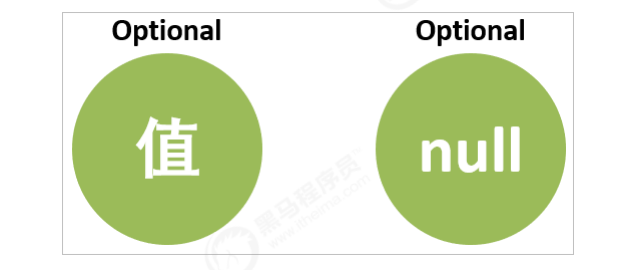

# Optional类

### 		以前对null的处理方式

```java
@Test 
public void test01() { 
    String userName = "凤姐"; 
    // String userName = null; 
    if (userName != null) { 
        System.out.println("用户名为:" + userName); 
    } else { 
        System.out.println("用户名不存在"); 
    } 
}
```


### 		Optional类介绍

​		Optional是一个没有子类的工具类，Optional是一个可以为null的容器对象。它的作用主要就是为了解决避免Null检查，防止NullPointerException。




### 		Optional的基本使用

##### 				Optional类的创建方式：

```java
Optional.of(T t); // 创建一个 Optional 实例 ，t 为 空 会报错

Optional.empty(); // 创建一个空的 Optional 实例 

Optional.ofNullable(T t); // 若 t 不为 null,创建 Optional 实例,否则创建空实例
```

##### 				Optional类的常用方法

```java
isPresent(); // 判断是否包含值,包含值返回true，不包含值返回false
get(); // 如果Optional有值则将其返回，否则抛出NoSuchElementException 
orElse(T t); // 如果调用对象包含值，返回该值，否则返回参数t 
orElseGet(Supplier s); // 如果调用对象包含值，返回该值，否则返回 s 获取的值 
map(Function f); // 如果有值对其处理，并返回处理后的Optional，否则返回 Optional.empty()
```

```java
@Test 
public void test02() { 
    // Optional<String> userNameO = Optional.of("凤姐"); 
    // Optional<String> userNameO = Optional.of(null); 
    // Optional<String> userNameO = Optional.ofNullable(null); 
    Optional<String> userNameO = Optional.empty(); 
    
    // isPresent() : 判断是否包含值,包含值返回true，不包含值返回false。 
    if (userNameO.isPresent()) { 
        // get() : 如果Optional有值则将其返回，否则抛出NoSuchElementException。 
        String userName = userNameO.get(); 
        System.out.println("用户名为:" + userName); 
    } else { 
        System.out.println("用户名不存在"); 
    } 
}
```


### 		Optional的高级使用		

```java
@Test 
public void test03() { 
    Optional<String> userNameO = Optional.of("凤姐"); 
    // Optional<String> userNameO = Optional.empty();
    // 存在做的什么 
    // userNameO.ifPresent(s -> System.out.println("用户名为" + s)); 
    
    // 存在做的什么,不存在做点什么 
    userNameO.ifPresentOrElse(s -> System.out.println("用户名为" + s) , () -> System.out.println("用户名不存在")); 
}

@Test 
public void test04() { 
    // Optional<String> userNameO = Optional.of("凤姐");
    Optional<String> userNameO = Optional.empty(); 
    // 如果调用对象包含值，返回该值，否则返回参数t 
    System.out.println("用户名为" + userNameO.orElse("null"));

	// 如果调用对象包含值，返回该值，否则返回参数Supplier得到的值 
    String s1 = userNameO.orElseGet(() -> {return "未知用户名";}); 
    System.out.println("s1 = " + s1); 
}

@Test 
public void test05() { 
    // User u = new User("凤姐", 18); 
    // User u = new User(null, 18); 
    // User u = null; 
    // System.out.println(getUpperCaseUserName1(u)); 
    
    // 我们将可能会为null的变量构造成Optional类型 
    // User u = new User("凤姐", 18); 
    User u = new User(null, 18); 
    Optional<User> uO = Optional.of(u); 
    System.out.println(getUpperCaseUserName2(uO)); 
}

// Optional 方式
public String getUpperCaseUserName2(Optional<User> uO) { 
    return uO.map(u -> u.getUserName()).map(name -> name.toUpperCase()).orElse("null"); 
}

// 传统方法
/*public String getUpperCaseUserName1(User u) { 
    if (u != null) { 
        String userName = u.getUserName(); 
        if (userName != null) { 
            return userName;
        } else {
            return null; 
        } 
    } else { 
        return null; 
    } 
}*/
```


### 		小结

​		Optional是一个可以为null的容器对象。orElse，ifPresent，ifPresentOrElse，map等方法避免对null的判断，写出更加优雅的代码。


# 新的日期和时间API

### 	旧版日期时间API存在的问题

##### 		1、设计很差

​			 在java.util和java.sql的包中都有日期类，java.util.Date同时包含日期和时间，而java.sql.Date仅包含日期。此外用于格式化和解析的类在java.text包中定义。

##### 		2、非线程安全

​			java.util.Date 是非线程安全的，所有的日期类都是可变的，这是Java日期类最大的问题之一。

##### 		3、时区处理麻烦

​			日期类并不提供国际化，没有时区支持，因此Java引入了java.util.Calendar和java.util.TimeZone类，但他们同样存在上述所有的问题。


### 	新日期时间 API介绍

​		JDK 8中增加了一套全新的日期时间API，这套API设计合理，是线程安全的。新的日期及时间API位于 java.time 包中，下面是一些关键类

​		LocalDate ：表示日期，包含年月日，格式为 2019-10-16

​		LocalTime ：表示时间，包含时分秒，格式为 16:38:54.158549300

​		LocalDateTime ：表示日期时间，包含年月日，时分秒，格式为 2018-09-06T15:33:56.750

​		DateTimeFormatter ：日期时间格式化类。

​		Instant：时间戳，表示一个特定的时间瞬间。

​		Duration：用于计算2个时间(LocalTime，时分秒)的距离

​		Period：用于计算2个日期(LocalDate，年月日)的距离

​		ZonedDateTime ：包含时区的时间

​		Java中使用的历法是ISO 8601日历系统，它是世界民用历法，也就是我们所说的公历。平年有365天，闰年是366天。此外Java 8还提供了4套其他历法，分别是：

​		ThaiBuddhistDate：泰国佛教历

​		MinguoDate：中华民国历

​		JapaneseDate：日本历

​		HijrahDate：伊斯兰历


### 	JDK 8的日期和时间类

​		LocalDate、LocalTime、LocalDateTime类的实例是不可变的对象，分别表示使用 ISO-8601 日历系统的日期、时间、日期和时间。它们提供了简单的日期或时间，并不包含当前的时间信息，也不包含与时区相关的信息。

```java
// LocalDate:获取日期时间的信息。格式为 2019-10-16 
@Test
public void test01() { 
    // 创建指定日期 
    LocalDate fj = LocalDate.of(1985, 9, 23); 
    System.out.println("fj = " + fj); 
    // 1985-09-23 
    // 得到当前日期 
    LocalDate nowDate = LocalDate.now(); 
    System.out.println("nowDate = " + nowDate); 
    // 2019-10-16 
    // 获取日期信息 
    System.out.println("年: " + nowDate.getYear()); 
    System.out.println("月: " + nowDate.getMonthValue()); 
    System.out.println("日: " + nowDate.getDayOfMonth()); 
    System.out.println("星期: " + nowDate.getDayOfWeek()); 
}

// LocalTime类: 获取时间信息。格式为 16:38:54.158549300
@Test 
public void test02() { 
    // 得到指定的时间 
    LocalTime time = LocalTime.of(12,15, 28, 129_900_000); 
    System.out.println("time = " + time); 
    // 得到当前时间 
    LocalTime nowTime = LocalTime.now(); 
    System.out.println("nowTime = " + nowTime); 
    // 获取时间信息 
    System.out.println("小时: " + nowTime.getHour()); 
    System.out.println("分钟: " + nowTime.getMinute()); 
    System.out.println("秒: " + nowTime.getSecond()); 
    System.out.println("纳秒: " + nowTime.getNano()); 
}

// LocalDateTime类: 获取日期时间信息。格式为 2018-09-06T15:33:56.750
@Test 
public void test03() { 
    LocalDateTime fj = LocalDateTime.of(1985, 9, 23, 9, 10, 20); 
    System.out.println("fj = " + fj); 
    // 1985-09-23T09:10:20 
    // 得到当前日期时间 
    LocalDateTime now = LocalDateTime.now(); 
    System.out.println("now = " + now); 
    // 2019-10-16T16:42:24.497896800 
    System.out.println(now.getYear()); 
    System.out.println(now.getMonthValue()); 
    System.out.println(now.getDayOfMonth());
    System.out.println(now.getHour()); 
    System.out.println(now.getMinute());
    System.out.println(now.getSecond()); 
    System.out.println(now.getNano()); 
}
```

​		对日期时间的修改，对已存在的LocalDate对象，创建它的修改版，最简单的方式是使用withAttribute方法。withAttribute方法会创建对象的一个副本，并按照需要修改它的属性。以下所有的方法都返回了一个修改属性的对象，他们不会影响原来的对象。

```java
// LocalDateTime类: 对日期时间的修改 
@Test 
public void test05() { 
    LocalDateTime now = LocalDateTime.now(); 
    System.out.println("now = " + now); 
    // 修改日期时间   修改后返回新的时间对象
    LocalDateTime setYear = now.withYear(2078); 
    System.out.println("修改年份: " + setYear); 
    System.out.println("now == setYear: " + (now == setYear)); 
    System.out.println("修改月份: " + now.withMonth(6)); 
    System.out.println("修改小时: " + now.withHour(9)); 
    System.out.println("修改分钟: " + now.withMinute(11)); 
    // 再当前对象的基础上加上或减去指定的时间 
    // plus：增加指定的时间
    // minus：
    LocalDateTime localDateTime = now.plusDays(5); 
    System.out.println("5天后: " + localDateTime); 
    System.out.println("now == localDateTime: " + (now == localDateTime)); 
    System.out.println("10年后: " + now.plusYears(10)); 
    System.out.println("20月后: " + now.plusMonths(20)); 
    System.out.println("20年前: " + now.minusYears(20)); 
    System.out.println("5月前: " + now.minusMonths(5)); 
    System.out.println("100天前: " + now.minusDays(100)); 
}
```

​		日期时间的比较

```java
// 日期时间的比较 
@Test 
public void test06() { 
    // 在JDK8中，LocalDate类中使用isBefore()、isAfter()、equals()方法来比较两个日期，可直接进行比较。 
    LocalDate now = LocalDate.now(); 
    LocalDate date = LocalDate.of(2018, 8, 8); 
    System.out.println(now.isBefore(date));// false 
    System.out.println(now.isAfter(date)); // true 
}
```


### 	JDK 8的时间格式化与解析

​		通过 java.time.format.DateTimeFormatter 类可以进行日期时间解析与格式化。

```java
// 日期格式化 
@Test 
public void test04() { 
    // 得到当前日期时间 
    LocalDateTime now = LocalDateTime.now(); 
    // JDK自带的时间格式
    // DateTimeFormatter formatter = DateTimeFormatter.ISO_DATE_TIME; 
    DateTimeFormatter formatter = DateTimeFormatter.ofPattern("yyyy-MM-dd HH:mm:ss"); 
    // 将日期时间格式化为字符串 
    String format = now.format(formatter); 
    System.out.println("format = " + format); 
    // 将字符串解析为日期时间 
    LocalDateTime parse = LocalDateTime.parse("1985-09-23 10:12:22", formatter); 
    System.out.println("parse = " + parse); 
}
```


### 	JDK 8的 Instant 类

​		Instant 时间戳/时间线，内部保存了从1970年1月1日 00:00:00以来的秒和纳秒。

```java
// 时间戳 
@Test 
public void test07() { 
    // Instant内部保存了秒和纳秒，一般不是给用户用的，而是方便程序做一些统计
	Instant now = Instant.now(); 
    System.out.println("当前时间戳 = " + now);
    // 获取从1970年1月1日 00:00:00的秒 
    System.out.println(now.getNano()); 
    System.out.println(now.getEpochSecond());
    System.out.println(now.toEpochMilli()); 
    System.out.println(System.currentTimeMillis());
    Instant instant = Instant.ofEpochSecond(5); 
    System.out.println(instant); 
}
```


### 	JDK 8的计算日期时间差类

​		Duration/Period类: 计算日期时间差。

​			1、 Duration：用于计算2个时间(LocalTime，时分秒)的距离

​			2、 Period：用于计算2个日期(LocalDate，年月日)的距离

```java
// Duration/Period类: 计算日期时间差 
@Test 
public void test08() {
    // Duration计算时间的距离 
    LocalTime now = LocalTime.now(); 
    LocalTime time = LocalTime.of(14, 15, 20);
    Duration duration = Duration.between(time, now); 
    System.out.println("相差的天数:" + duration.toDays()); 
    System.out.println("相差的小时数:" + duration.toHours()); 
    System.out.println("相差的分钟数:" + duration.toMinutes()); 
    System.out.println("相差的秒数:" + duration.toSeconds()); 
    // Period计算日期的距离 
    LocalDate nowDate = LocalDate.now(); 
    LocalDate date = LocalDate.of(1998, 8, 8); 
    // 让后面的时间减去前面的时间 
    Period period = Period.between(date, nowDate); 
    System.out.println("相差的年:" + period.getYears());
    System.out.println("相差的月:" + period.getMonths());
    System.out.println("相差的天:" + period.getDays()); 
}
```


### 	JDK 8的时间校正器

​		有时我们可能需要获取例如：将日期调整到“下一个月的第一天”等操作。可以通过时间校正器来进行。

​			1、TemporalAdjuster : 时间校正器。

​			2、TemporalAdjusters : 该类通过静态方法提供了大量的常用TemporalAdjuster的实现。

```java
// TemporalAdjuster类:自定义调整时间 
@Test 
public void test09() { 
    LocalDateTime now = LocalDateTime.now(); 
    // 得到下一个月的第一天 
    TemporalAdjuster firsWeekDayOfNextMonth = temporal -> { 
        LocalDateTime dateTime = (LocalDateTime) temporal; 
        LocalDateTime nextMonth = dateTime.plusMonths(1).withDayOfMonth(1);
        System.out.println("nextMonth = " + nextMonth); return nextMonth; 
    };
    
    LocalDateTime nextMonth = now.with(firsWeekDayOfNextMonth); 
    System.out.println("nextMonth = " + nextMonth); 
}
```


### 	JDK 8设置日期时间的时区

​		Java8 中加入了对时区的支持，LocalDate、LocalTime、LocalDateTime是不带时区的，带时区的日期时间类分别为：ZonedDate、ZonedTime、ZonedDateTime。

​		其中每个时区都对应着 ID，ID的格式为 “区域/城市” 。例如 ：Asia/Shanghai 等。

​		ZoneId：该类中包含了所有的时区信息

```java
// 设置日期时间的时区 
@Test 
public void test10() { 
    // 1.获取所有的时区ID 
    // ZoneId.getAvailableZoneIds().forEach(System.out::println); 
    
    // 不带时间,获取计算机的当前时间 
    LocalDateTime now = LocalDateTime.now(); 
    // 中国使用的东八区的时区.比标准时间早8个小时 
    System.out.println("now = " + now); 
    // 2.操作带时区的类 
    // now(Clock.systemUTC()): 创建世界标准时间 
    ZonedDateTime bz = ZonedDateTime.now(Clock.systemUTC()); System.out.println("bz = " + bz);
    // now(): 使用计算机的默认的时区,创建日期时间 
    ZonedDateTime now1 = ZonedDateTime.now(); System.out.println("now1 = " + now1); // 2019-10- 19T16:19:44.007153500+08:00[Asia/Shanghai] 
    
    // 使用指定的时区创建日期时间 
    ZonedDateTime now2 = ZonedDateTime.now(ZoneId.of("America/Vancouver"));
    System.out.println("now2 = " + now2); // 2019-10-19T01:21:44.248794200- 07:00[America/Vancouver]
}
```


### 	小结

​		详细学习了新的日期是时间相关类，LocalDate表示日期,包含年月日,LocalTime表示时间,包含时分秒,LocalDateTime = LocalDate + LocalTime,时间的格式化和解析,通过DateTimeFormatter类型进行

​		学习了Instant类,方便操作秒和纳秒,一般是给程序使用的.学习Duration/Period计算日期或时间的距离,还使用时间调整器方便的调整时间,学习了带时区的3个类ZoneDate/ZoneTime/ZoneDateTime


### 	JDK 8新的日期和时间 API的优势：

​		1、新版的日期和时间API中，日期和时间对象是不可变的。操纵的日期不会影响老值，而是新生成一个实例。

​		2、新的API提供了两种不同的时间表示方式，有效地区分了人和机器的不同需求。

​		3、TemporalAdjuster可以更精确的操纵日期，还可以自定义日期调整器。	

​		4、是线程安全的


# JDK 8重复注解与类型注解

### 	重复注解的使用

​	自从Java 5中引入 注解 以来，注解开始变得非常流行，并在各个框架和项目中被广泛使用。不过注解有一个很大的限制是：在同一个地方不能多次使用同一个注解。JDK 8引入了重复注解的概念，允许在同一个地方多次使用同一个注解。在JDK 8中使用**@Repeatable**注解定义重复注解。

#### 	重复注解的使用步骤：

##### 		1、 定义重复的注解容器注解

```java
@Retention(RetentionPolicy.RUNTIME) 
@interface MyTests { 
	MyTest[] value(); 
}
```

##### 		2、 定义一个可以重复的注解

```java
@Retention(RetentionPolicy.RUNTIME) 
@Repeatable(MyTests.class) 
@interface MyTest { 
    String value(); 
}
```

##### 		3、配置多个重复的注解

```java
@MyTest("tbc") 
@MyTest("tba") 
@MyTest("tba") 
public class Demo01 { 
    
    @MyTest("mbc") 
    @MyTest("mba") 
    public void test() throws NoSuchMethodException { 
    
    } 
}
```

##### 		4、解析得到指定注解

```java
// 3.配置多个重复的注解 
@MyTest("tbc") 
@MyTest("tba") 
@MyTest("tba")
public class Demo01 { 
    @Test 
    @MyTest("mbc") 
    @MyTest("mba") 
    public void test() throws NoSuchMethodException { 
        // 4.解析得到类上的指定注解 
        MyTest[] tests = Demo01.class.getAnnotationsByType(MyTest.class); 
        for (MyTest test : tests) { 
            System.out.println(test.value()); 
        }
        System.out.println("-----------------------");
        // 得到方法上的指定注解 
        Annotation[] tests1 = Demo01.class.getMethod("test").getAnnotationsByType(MyTest.class); 
        for (Annotation annotation : tests1) { 
            System.out.println("annotation = " + annotation); 
        } 
    } 
}
```


### 	类型注解的使用

​	JDK 8为@Target元注解新增了两种类型： TYPE_PARAMETER ， TYPE_USE 。 

​		TYPE_PARAMETER ：表示该注解能写在类型参数的声明语句中。 类型参数声明如： <T> 、 

​		TYPE_USE ：表示注解可以再任何用到类型的地方使用。

#### 	TYPE_PARAMETER的使用

```java
@Target(ElementType.TYPE_PARAMETER) 
@interface TyptParam { 
    
}
public class Demo02<@TyptParam T> { 
    public static void main( String[] args) {
    
    }
    
    public <@TyptParam E> void test( String a) {
    
    } 
}
```

#### 		TYPE_USE的使用

```java
@Target(ElementType.TYPE_USE) 
@interface NotNull {

}
public class Demo02<@TyptParam T extends String> { 
    private @NotNull int a = 10;
    public static void main(@NotNull String[] args) { 
        @NotNull int x = 1;
        @NotNull String s = new @NotNull String();
    }
    public <@TyptParam E> void test( String a) { 
    } 
}
```


### 小结

​	通过@Repeatable元注解可以定义可重复注解， TYPE_PARAMETER 可以让注解放在泛型上， TYPE_USE 可以让注解放在类型的前面